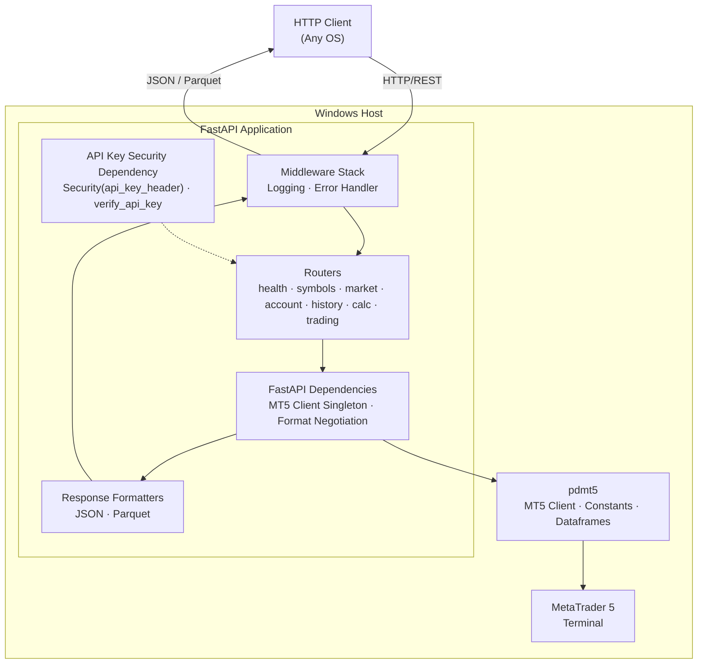

# mt5api

MetaTrader 5 REST API

[](https://github.com/dceoy/mt5api/actions/workflows/ci.yml)

mt5api exposes MT5 market data, account info, trading history, trading state,
order validation, and operational terminal endpoints over HTTP. It is a
FastAPI/HTTP adapter over [`pdmt5`](https://github.com/dceoy/pdmt5), which
provides the core MT5 client, dataframe/order primitives, and canonical MT5
constant parsing. mt5api adds optional API-key auth and JSON/Parquet response
formatting.

The exposed operational surface is deliberately narrow: mt5api validates trade
requests and manages terminal-side subscriptions or MarketWatch visibility, but
it does not expose live order-send endpoints or implement strategy orchestration.

The API server must run on Windows. pdmt5 connects through the MetaTrader 5
Python API, which is supported only on Windows, so you must host `mt5api` on a
Windows machine with a logged-in MetaTrader 5 terminal. HTTP clients can connect
from any operating system.

## Architecture



## Features

- REST endpoints for symbols, market data, account info, orders, positions,
  history, margin/profit calculations, order validation, and terminal operations
- JSON and Apache Parquet responses (content negotiation)
- Optional API key authentication
- Structured JSON logging
- OpenAPI/Swagger docs built into the API

## Requirements

- Python 3.11+
- Windows host with MetaTrader 5 terminal installed and logged in
- Linux and macOS are not supported for the API server runtime, but they work
  for HTTP clients

## Installation

Install and run the API on the Windows machine where MetaTrader 5 is installed.

Install the latest release from PyPI:

```console
pip install mt5api
```

Or, when managing the project with `uv`, add it as a dependency:

```console
uv add mt5api
```

Alternatively, install from source:

```powershell
git clone https://github.com/dceoy/mt5api.git
cd mt5api
uv sync
```

## Running the API on Windows

After installing from PyPI:

```powershell
$env:MT5API_SECRET_KEY = "your-secret-api-key"  # Optional: omit to disable auth
$env:MT5API_ROUTER_PREFIX = "/api/v1"     # Optional: omit for root-level routes
python -m mt5api
```

`python -m mt5api` reads `MT5API_HOST`, `MT5API_PORT`, and `MT5API_LOG_LEVEL`
from the environment. You can also invoke `uvicorn` directly:

```powershell
uvicorn mt5api.main:app --host 0.0.0.0 --port 8000
```

If you cloned the source tree, prepend `uv run` to either command (for example,
`uv run uvicorn mt5api.main:app --host 0.0.0.0 --port 8000`).

Docs:

- Swagger UI: `http://localhost:8000/docs`
- OpenAPI JSON: `http://localhost:8000/openapi.json`

Set `MT5API_ROUTER_PREFIX` to mount the API endpoints under a shared path such
as `/api/v1`. The default is `""`, which keeps routes like `/health` and
`/symbols` at the root. `"/api/v1"`, `"api/v1"`, and `"/api/v1/"` are treated
the same.

Set `MT5API_MAX_MARKET_BOOK_SUBSCRIPTIONS` to cap active market-book
subscriptions. The default limit is `100`.

## Example Requests with curl

Replace `windows-host` with the DNS name or IP address of the Windows machine
running `mt5api`. If you run the request on that Windows host, `localhost` also
works. In PowerShell, use `curl.exe` if `curl` resolves to
`Invoke-WebRequest`.

```console
curl "http://windows-host:8000/health"
```

```console
# Include X-API-Key only when MT5API_SECRET_KEY is configured on the server.
curl -H "X-API-Key: your-secret-api-key" "http://windows-host:8000/symbols?group=*USD*"
```

```console
curl -H "X-API-Key: your-secret-api-key" -H "Accept: application/parquet" "http://windows-host:8000/rates/from?symbol=EURUSD&timeframe=TIMEFRAME_M1&date_from=2024-01-01T00:00:00Z&count=100"
```

Market-data and calculation endpoints accept MetaTrader 5 constants by official
name (`TIMEFRAME_M1`, `COPY_TICKS_ALL`, `ORDER_TYPE_BUY`), short alias (`M1`,
`ALL`, `BUY`), or integer value.

## Endpoints

If `MT5API_ROUTER_PREFIX` is set, prepend that value to every API route below.

### Read-Only Endpoints

- Health: `GET /health`, `GET /version`, `GET /last-error`
- Symbols: `GET /symbols`, `GET /symbols/total`, `GET /symbols/{symbol}`,
  `GET /symbols/{symbol}/tick`
- Market data: `GET /rates/from`, `GET /rates/from-pos`, `GET /rates/range`,
  `GET /ticks/from`, `GET /ticks/range`, `GET /market-book/{symbol}`
- Calculations: `GET /calc/margin`, `GET /calc/profit`
- Account: `GET /account`, `GET /terminal`
- Trading state: `GET /positions`, `GET /positions/total`,
  `GET /orders`, `GET /orders/total`
- History: `GET /history/orders`, `GET /history/orders/total`,
  `GET /history/deals`, `GET /history/deals/total`

### Operational Endpoints

- `POST /symbols/{symbol}/select` — Show or hide symbol in MarketWatch
- `POST /market-book/{symbol}/subscribe` — Subscribe to DOM events
- `POST /market-book/{symbol}/unsubscribe` — Unsubscribe from DOM events
- `POST /order/check` — Validate a trade request without execution

## License

MIT License - see [LICENSE](https://github.com/dceoy/mt5api/blob/main/LICENSE).
